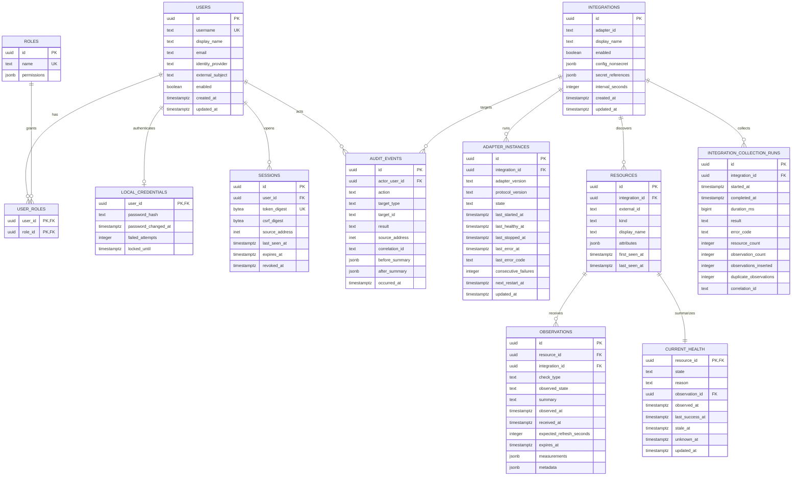
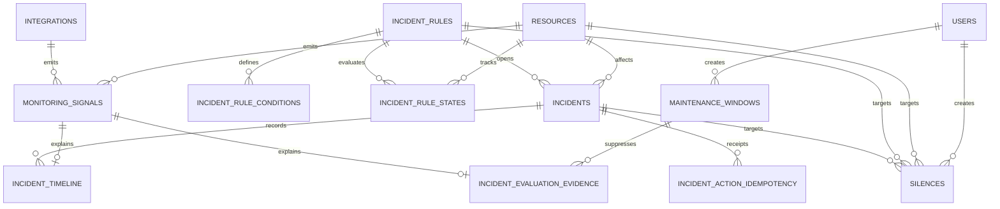

# Operational data model

PostgreSQL is authoritative for identity, configuration, current health, normalized
observations, audit history, the Phase 2 monitoring-signal journal, and incidents.
The first diagram preserves the Phase 1 foundation; notification, certificate,
dependency, and physical inventory tables arrive in later roadmap slices.

## Phase 2 incident addendum

- `monitoring_signals.source_key` is unique and is committed atomically with its
  observation or freshness transition. Claim, attempt, completion, retry, and
  dead-letter fields make evaluator work replayable without SSE.
- `incident_rule_states` persists matching/recovery start times, occurrence counts,
  due deadlines, last signal ordering, and the active incident link for one
  `(rule, resource, check_type)` tuple.
- A partial unique index permits at most one non-resolved incident for a stable
  `(rule_id, resource_id, check_type)` fingerprint.
- `incident_timeline` is append-only through database triggers. Detection,
  meaningful severity change, recurrence, recovery, Operator actions, assignment,
  and notes create immutable evidence. Operator and assignment-subject display text
  is copied into the event so later identity changes do not rewrite history.
- `incident_action_idempotency` binds actor, incident, action, and key to the
  request hash and original result/timeline/correlation receipt. It is written in
  the same transaction as the incident, timeline, and redacted audit event.
- `maintenance_windows` stores bounded, start-inclusive/end-exclusive one-time
  UTC controls over integration/resource/check scopes. It never replaces raw
  `current_health`; effective read models join the active winning window.
- `incident_evaluation_evidence` stores the winning rule, optional maintenance
  window, outcome, and bounded explanation for each processed signal.
- `silences` has exactly one incident/rule/resource target and a strict expiry.
  Matching is read-only with respect to incidents and is consumed by the later
  notification-intent transaction.
- `administrative_mutation_idempotency` binds actor, target type, operation, and
  key to a request hash and original version/correlation receipt for rule and
  suppression mutations.
- Incident and timeline rows are retained; later retention policy must not remove
  evidence earlier than the audit retention boundary.

## Invariants

- `(integration_id, external_id)` uniquely identifies a resource.
- `current_health` has exactly one row per resource and references the observation
  that last changed its evaluated state.
- Observation ingestion and current-state replacement happen in one transaction.
- A successful collection run and its audit-success record commit in that same
  transaction; rejected/failed runs contain only safe categories and counts.
- `observed_at` is source time; ingestion time is separately recorded in migrations
  even when omitted from the conceptual diagram.
- `(integration_id, resource_id, check_type, observed_at)` is the normalized
  observation delivery key when a source UUID is absent. Retrying the same payload
  is a no-op; conflicting content for the same key is rejected.
- Staleness is derived from expected refresh and persisted as a state transition so
  clients receive a live event and history remains explainable.
- Audit records are append-only to application roles. Corrections create a new
  event; they do not update old events.
- Secrets are references, never values, in `integrations` and audit summaries.
- Adapter-instance restart counters and deadlines are persisted so restarting Core
  cannot erase a failing adapter's backoff. Host-local process IDs are not stored.

## Migration rules

Migrations are numbered, forward-only SQL with `up` and explicit documented
rollback/recovery guidance. Core refuses to start when the database is newer than
the binary. Destructive or long-running migrations require a two-release expand /
migrate / contract sequence.

## Retention in Phase 1

Keep current state indefinitely while the resource exists. Retain detailed
observations for 90 days initially and audit events for at least six months; make
both durations configurable but enforce a safe minimum for audit data. A later
retention worker will downsample older operational measurements rather than copy a
metrics platform.
