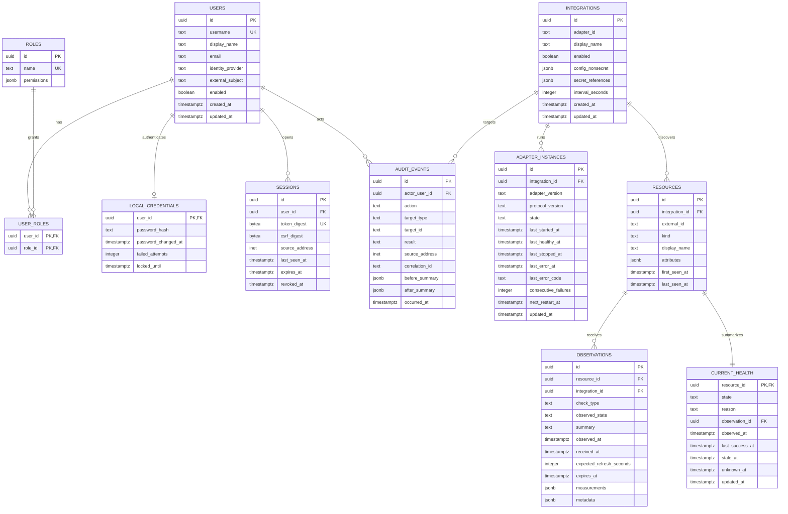

# Initial Phase 1 data model

PostgreSQL is authoritative for identity, configuration, current health, normalized
observations, and audit history. The diagram is intentionally limited to Phase 1;
incident, notification, certificate, dependency, and physical inventory tables are
added in their roadmap phases.

## Invariants

- `(integration_id, external_id)` uniquely identifies a resource.
- `current_health` has exactly one row per resource and references the observation
  that last changed its evaluated state.
- Observation ingestion and current-state replacement happen in one transaction.
- `observed_at` is source time; ingestion time is separately recorded in migrations
  even when omitted from the conceptual diagram.
- `(integration_id, resource_id, check_type, observed_at)` is the normalized
  observation delivery key when a source UUID is absent. Retrying the same payload
  is a no-op; conflicting content for the same key is rejected.
- Staleness is derived from expected refresh and persisted as a state transition so
  clients receive a live event and history remains explainable.
- Audit records are append-only to application roles. Corrections create a new
  event; they do not update old events.
- Secrets are references, never values, in `integrations` and audit summaries.
- Adapter-instance restart counters and deadlines are persisted so restarting Core
  cannot erase a failing adapter's backoff. Host-local process IDs are not stored.

## Migration rules

Migrations are numbered, forward-only SQL with `up` and explicit documented
rollback/recovery guidance. Core refuses to start when the database is newer than
the binary. Destructive or long-running migrations require a two-release expand /
migrate / contract sequence.

## Retention in Phase 1

Keep current state indefinitely while the resource exists. Retain detailed
observations for 90 days initially and audit events for at least six months; make
both durations configurable but enforce a safe minimum for audit data. A later
retention worker will downsample older operational measurements rather than copy a
metrics platform.
